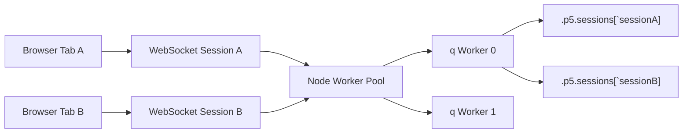

# Runtime Architecture

## Model

- Node keeps a small pool of long-lived q worker processes.
- Each websocket connection is assigned one stable `sessionId` and one q worker.
- Each run loads the sketch into a fresh q namespace and stores that session's `setup`, `draw`, `state`, `document`, and command buffer under `.p5.sessions[sessionId]`.
- Calls on the same worker are serialized through a queue, so sessions sharing one worker do not interleave state mutations.

## Why This Shape

- It avoids restarting q on every `run`.
- It preserves rerun semantics by resetting session-local sketch bindings and state.
- It allows multiple browser tabs or users to share a worker when `P5Q_WORKER_POOL_SIZE` is smaller than the active session count.

## Current Limits

- Session isolation is a correctness boundary, not a security boundary.
- One busy sketch can still block other sessions on the same worker.
- If you need better parallelism, increase `P5Q_WORKER_POOL_SIZE`.
